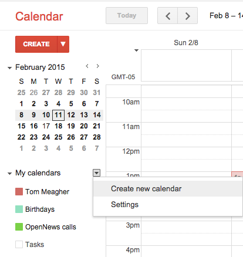
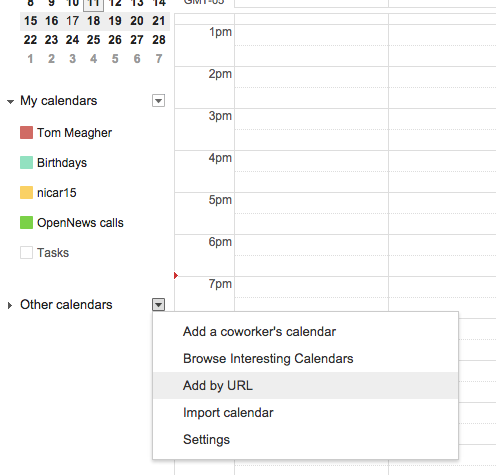
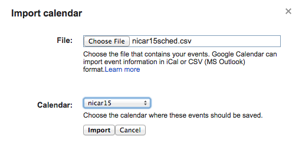

#Import NICAR into GCal
This csv is designed to make it easy to import into Google Calendar.

Step 1: First, go into Gcal and click the dropdown arrow next to "My Calendar" and click "Create new calendar". Let's name it "nicar15".

Step 2: Now that you have a calendar set up, you can import your csv into it (without polluting your primary calendar). Click on the dropdown arrow next to "Other calendars" and click "Import calendar."

Step 3: On the modal window, it will ask you to choose the file you want to use. Download [nicar15sched.csv](https://raw.githubusercontent.com/tommeagher/Scrapers/master/nicarscraper/nicar15sched.csv) to your local machine, then add it with the chooser.

Finally, before you hit "Import," be certain to choose the "nicar15" calendar, rather than your primary one.

Now you'll have all the sessions on your phone with GCal. When the CSV changes as new sessions are added, just delete your "nicar15" calendar and repeat Steps 1 through 3 with the updated CSV. Then, all you have to do is decide which sessions to hit.

Go!
